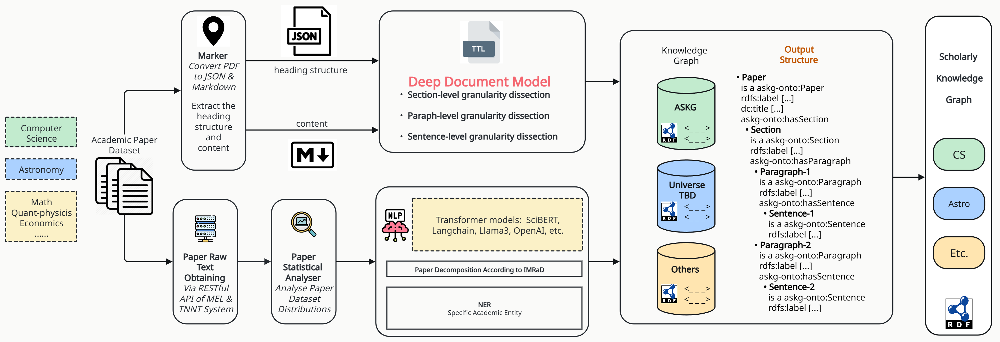

# DPFusion (DDM_PARSE_Fusion）
This repository continues our previous work titled **"Towards Building an RDF-based Deep Document Model and Retrieval-Augmented Generation System for Enhanced Question Answering with Large Language Models"**.

The primary focus of this repository is:
- **Integration of the PARSE+DDM pipelines** to build a automated framework for Knowledge graph construction and information retrieval.
- Conducting experiments with **StructRAG**, a **Structure-Aware Retrieval-Augmented Generation Framework**, which leverages a **Scholarly Knowledge Graph**

**To enable:**
- **Structurally-aware** question answering by incorporating hierarchical document structures.
- **Diverse** and **path-enhanced** responses through enhanced retrieval mechanisms.  
- **Accurate** and **high-quality** answers by leveraging structural metadata and scholarly knowledge graphs.

